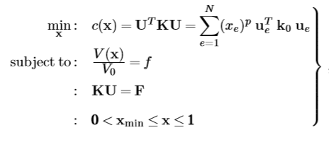
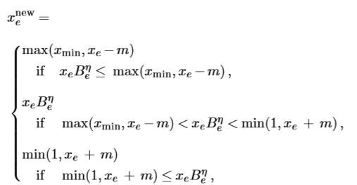
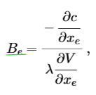
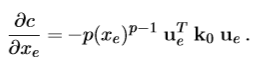
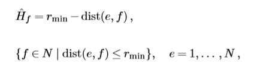
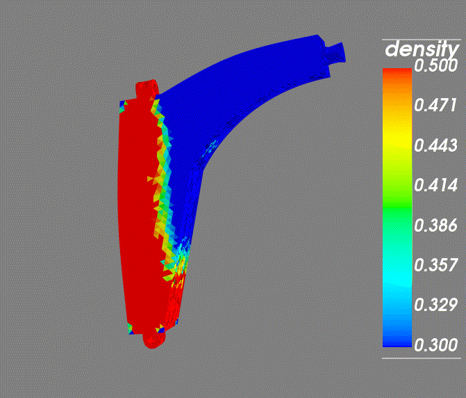

# Topology-optimizer

This project contains topology optimization of structure with SIMP ,the codes are written by Python and used the FEA solver api provided by ANSYS. 

## python environment configuration
This app is developed in python 3.6 and require packages as follows :
* trait 4.6.0
* traitsui 5.1.0
* mayavi 4.5.0
* vtk 8.1.0
* PyQt 4.11 (this is very important ,if you use PyQt 4.12 ,the app will not work)

## version info
All version information are discribed as follows:

### version 1.0.0
* This is a basic optimization frame. 
* The benchmark is a 2D rectangular cantilever , contains two modules: optimization and finite element analysis.The next release will contain data visualization of stress, strain,and displacement. 

### version 1.1.0
This version contains postprocessor to visualize the optimization results． 
Mainly include: 
* Show the stress, strain, and displacement timely. 
* Show the convergence curve timely. 
* Animate the results and make movie.  
The SDK is Mayavi+traits+traitsUI+tvtk. 
  
### version 1.2.0
This version is versatile,it can optimize 2D and 3D structure no matter using what kind of grid to mesh the geometry. 
And,this vertion is more much more efficient as I replaced the for loop by vectorizing.

### version 1.3.0
this version used a new algorithm to restrain checkerboard and mesh independence, And no longer computing strain energy in every iteration step ,instead we getting strain energy from ANSYS directly.This improvement can enhance the robust and efficiency of the optimizer. 

### version 1.4.0
* For robust ,use the same filter as mentioned in "top99"
* save pictures and make movie by ffmpeg
* transfer topology results formated by vtu to stl format which can be used to 3D printing

## GUI exhibition
The app named as shorthaircat. 
Shorthaircat could show convergency curve and displacement, stress ,strain ,density in time. 
we choose some GUI figures exhibited here:

## Algorithm，hyperparameters 

* Algorithm  
The algorithm is simp method , and the filter is the same with 'top99 lines matlab codes'. The iteration method is OC. 
Algorithm we used need some finite analysis data which we all extract from ANSYS  
*Including*:
displacement,stress ,strain ,element strain energy , element volume ,element center coordinates ,element's nodes number , each element's adjacent elements which used in filter. 

*Objective function*:

*Updating scheme*:

Where Be and sensitivity are calculated by the fomulas below:

  

*Filter(used to eliminate checkerboard and mesh-independent)*

where the weight factor Hf is calculated as follows:

* Hyperparameter  
There are two kind of hyperparameter in the algorithm: 
material properties: Young's module and Poisson rate 
If the total strain energy is too small ,you can increase Young's module so the algorithm will much more robust
simp methond's hyperparameter : Rmin and move 
* `--Rmin`:a pretty important hyperparameter which can determine your final results. As mentioned in sigmund's PHD thesis , Rmin is approximately the same as the minimun dimention in the toplogy 
* `--move`:If your convergence curve vibrates you could decrease the value of move  

## gallery and benchmarks
we choose some benchmarks tested on our program and exihibit the results: 
* cantilever 2D:

* 3D cantilever with center load

* L_shape problem

* MBB

* complex2D

* complex3D

